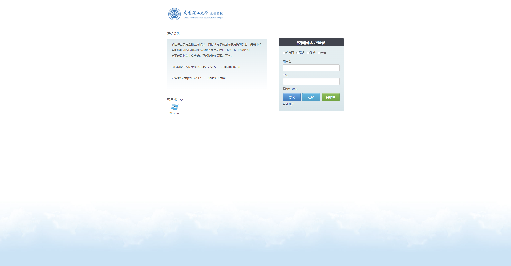

# 大连理工大学盘锦校区自动登录校园网



## 1. 安装必要库

```bash
pip install pyYAML requests

# 可选
pip install bs4
```

## 2. 配置

复制 `example.config.yaml` 为 `config.yaml`，并修改其中的配置项。

```yaml
# config.yaml
domain: '运营商' # 选择以下几个：yidong liantong dianxin jiaoyu
username: '你的学号'
password: '你的密码'
```

## 3. 运行

```bash
python main.py
```